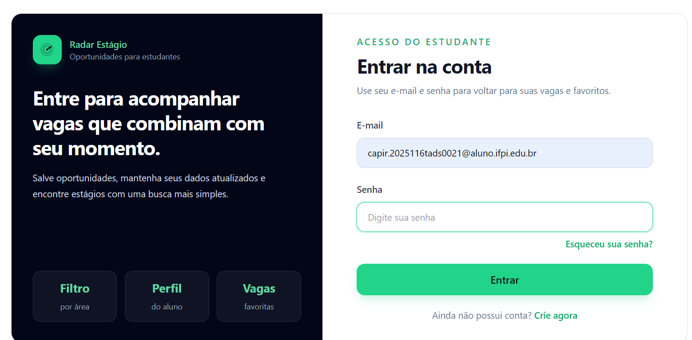
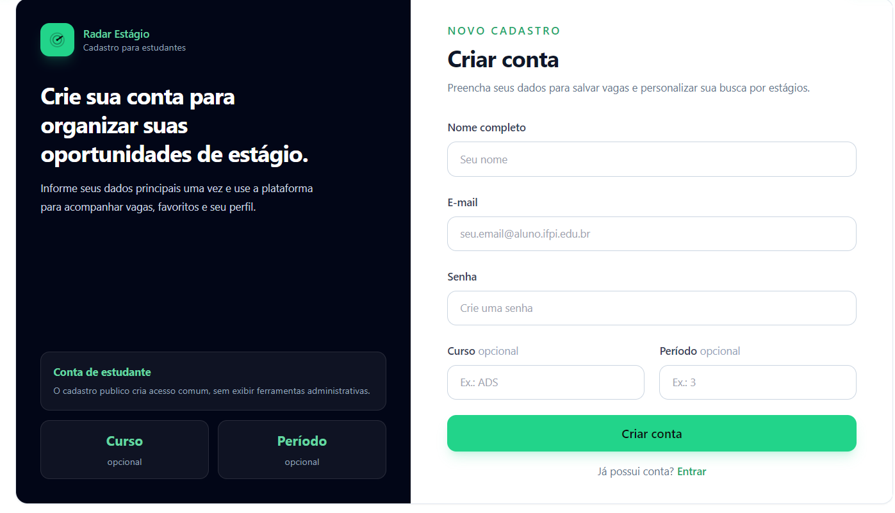
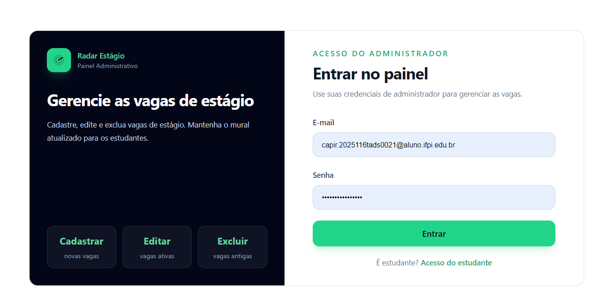

# Radar Estágio

Agregador de vagas de estágio para estudantes, com busca, filtros, favoritos, perfil e painel de administração. Feito para estudantes acadêmicos iniciantes que querem encontrar e organizar oportunidades de estágio em um só lugar.

---

## Contexto e problema

Encontrar estágio é, na prática, uma tarefa fragmentada. As oportunidades ficam espalhadas por dezenas de portais, grupos de WhatsApp, e-mails de coordenação e redes sociais. Para um estudante iniciante, isso cria três dores reais:

- **Dispersão:** a mesma vaga aparece em vários lugares, e muitas sequer aparecem onde o aluno costuma olhar.
- **Dificuldade de acompanhamento:** sem um ponto central, é fácil perder prazos e esquecer vagas interessantes.
- **Falta de organização:** não há um lugar para guardar, comparar e retomar as oportunidades que fazem sentido para o perfil do estudante.

O **Radar Estágio** nasce para resolver exatamente isso: ser o "radar" que centraliza, filtra e mantém visíveis as vagas de estágio relevantes para quem está começando.

---

## Solução

O aplicativo reúne as vagas de estágio em um único painel e oferece as seguintes funcionalidades:

- **Agregação de vagas:** todas as oportunidades publicadas ficam disponíveis em uma lista central (`/vagas`).
- **Busca e filtros:** o estudante pode pesquisar por termo e filtrar vagas por critérios (área, modalidade etc.) através das features `job-search` e `job-filter`.
- **Favoritar:** vagas podem ser salvas como favoritas e consultadas depois em `/favoritos`, sem perder o que era interessante.
- **Perfil do estudante:** área autenticada (`/perfil`) para gerenciar a conta e ver dados do usuário.
- **Painel administrativo:** o administrador publica, edita e remove vagas pelo `/admin`, com CRUD completo de jobs.
- **Autenticação completa:** login, cadastro, recuperação e redefinição de senha, com confirmação de e-mail.

---

## Público-alvo

Estudantes universitários e **iniciantes acadêmicos** em busca do primeiro estágio. O foco é quem ainda não tem experiência de mercado e precisa de um ponto de partida simples, organizado e confiável para acompanhar oportunidades.

---

## Tecnologias utilizadas

| Tecnologia | Papel no projeto |
|---|---|
| **React 19** | Biblioteca de UI para construir a interface componentizada e reativa. |
| **Vite** | Build tool e dev server (HMR rápido) usado em `npm run dev` e `npm run build`. |
| **TypeScript** | Tipagem estática de todo o código, checada no build de produção. |
| **Tailwind CSS** | Estilização utilitária e base do Design System (tokens de cor e tipografia). |
| **React Hook Form** | Gerenciamento de formulários (Login, Cadastro, Perfil, Admin etc.). |
| **Zod** | Validação de esquemas dos formulários (ex.: regex de senha forte). |
| **Supabase (`@supabase/supabase-js`)** | Backend: autenticação (Auth) e banco de dados (Postgres + RLS). |
| **Vercel** | Hospedagem da SPA, com `vercel.json` cuidando de rewrite e cabeçalhos de segurança. |

---

## Arquitetura (Feature-Sliced Design)

O projeto segue o **Feature-Sliced Design (FSD)**, separando o código em camadas com dependências unidirecionais (camadas de cima dependem das de baixo, nunca o contrário):

- **`app/`** — inicialização e roteamento (`router`). Onde a aplicação é montada e as rotas são declaradas.
- **`entities/`** — modelos de domínio reutilizáveis: `session` (usuário/auth), `job` (vaga), `favorite` (favorito). Cada entidade isola seus tipos, hooks e chamadas de API.
- **`features/`** — funcionalidades de negócio compostas a partir de entities: `job-search` (busca) e `job-filter` (filtros).
- **`widgets/`** — blocos de UI combinando várias entities/features: `layout`, `job-card`, `job-board`, `favorites-list`, `admin-panel`.
- **`pages/`** — páginas completas que montam os widgets por rota (Home, Login, Vagas, Favoritos etc.).
- **`shared/`** — código transversal: `ui` (Design System: Button, Card, Badge, RadarIcon, PageHeader, PasswordStrength, ProtectedRoute) e `lib` (ex.: cliente Supabase, utilitários).

---

## Custom Hooks

Três hooks customizados isolam a lógica de estado e dados para fora dos componentes:

- **`useAuth`** — [`src/entities/session/model/useAuth.ts`](src/entities/session/model/useAuth.ts)
  Sincroniza o usuário do Supabase com o estado da aplicação e assina as mudanças de autenticação (`onAuthStateChange`) para manter a sessão sempre atualizada.

- **`useJobs`** — [`src/widgets/job-board/model/useJobs.ts`](src/widgets/job-board/model/useJobs.ts)
  Carrega as vagas, aplica filtros/busca e resolve os favoritos do usuário logado, entregando à `job-board` a lista pronta para renderizar.

- **`useFavoritos`** — [`src/widgets/favorites-list/model/useFavoritos.ts`](src/widgets/favorites-list/model/useFavoritos.ts)
  Carrega a lista de favoritos e expõe a remoção de favoritos, alimentando a `favorites-list`.

---

## Operações CRUD

Todas as operações usam o cliente Supabase. Resumo por entidade:

### `jobs` (vagas) — [`src/widgets/admin-panel/AdminPanel.tsx`](src/widgets/admin-panel/AdminPanel.tsx)

| Operação | Arquivo | Chamada Supabase |
|---|---|---|
| Insert | `AdminPanel.tsx` | `supabase.from('jobs').insert(...)` |
| Select | `AdminPanel.tsx` / `jobsApi.ts` | `supabase.from('jobs').select(...)` |
| Update | `AdminPanel.tsx` | `supabase.from('jobs').update(...).eq('id', id)` |
| Delete | `AdminPanel.tsx` | `supabase.from('jobs').delete().eq('id', id)` |

### `favorites` (favoritos) — [`src/entities/favorite/api/favoritesApi.ts`](src/entities/favorite/api/favoritesApi.ts)

| Operação | Arquivo | Chamada Supabase |
|---|---|---|
| Insert | `favoritesApi.ts` | `supabase.from('favorites').insert({ user_id, job_id })` |
| Select | `favoritesApi.ts` | `supabase.from('favorites').select('job_id').eq('user_id', userId)` |
| Delete | `favoritesApi.ts` | `supabase.from('favorites').delete().eq('user_id', userId).eq('job_id', jobId)` |

---

## Formulários e validação

Todos os formulários usam **React Hook Form + Zod**, mantendo a validação no cliente antes de qualquer chamada ao backend. Os esquemas ficam em [`src/entities/session/model/auth.schemas.ts`](src/entities/session/model/auth.schemas.ts), com `loginSchema` e `cadastroSchema`.

Exemplo — o `cadastroSchema` exige senha forte via regex, impedindo que um dado inválido chegue ao Supabase:

```ts
// src/entities/session/model/auth.schemas.ts (resumo)
export const cadastroSchema = z.object({
  nome: z.string().trim().min(2, 'Informe seu nome completo.'),
  email: z.string().trim().email('Informe um e-mail válido.'),
  password: z
    .string()
    .min(8, 'A senha deve ter ao menos 8 caracteres.')
    .regex(/[a-z]/, 'Inclua ao menos uma letra minúscula.')
    .regex(/[A-Z]/, 'Inclua ao menos uma letra maiúscula.')
    .regex(/\d/, 'Inclua ao menos um número.')
    .regex(/[^A-Za-z0-9]/, 'Inclua ao menos um caractere especial (ex.: !@#$%).'),
  curso: z.string().trim().optional().or(z.literal('')),
  periodo: z.string().trim().optional().or(z.literal('')), // validado por refine
});
```

Formulários cobertos: **Login**, **Cadastro**, **EsqueciSenha**, **RedefinirSenha**, **Perfil** e **AdminLogin**.

---

## Design System

Documentado em detalhe em [`DESIGN_SYSTEM.md`](DESIGN_SYSTEM.md). Resumo dos tokens definidos em `tailwind.config.js`:

**Cores (tokens):**

| Token | Significado / uso |
|---|---|
| `radar` | Verde-fósforo (primária, `500 = #22D48A`) — botões, links ativos, destaques. |
| `ink` | Grafite — `900` (fundo), `800` (card), `700` (borda). |
| `success` | Verde de confirmação (ex.: vaga favoritada). |
| `danger` | Vermelho de erro e ações destrutivas. |

**Tipografia:**

- **Inter** (`font-sans`) — corpo e formulários (legibilidade).
- **Space Grotesk** (`font-display`) — títulos e wordmark do logo.
- Tokens de `borderRadius` (`card`, `control`) e `shadow` (`card`).

**Componentes reutilizáveis** em [`src/shared/ui/`](src/shared/ui/):

- `Button` (variantes `primary`, `secondary`, `ghost`, `danger`)
- `Card`, `Badge`, `RadarIcon`, `PageHeader`, `PasswordStrength`, `ProtectedRoute`

---

## Segurança

Proteções implementadas no projeto:

- **Senha forte** (8+ caracteres com maiúscula, minúscula, número e símbolo) validada via Zod antes de qualquer envio.
- **Confirmação de e-mail** obrigatória no cadastro.
- **Recuperação de senha** com fluxo `/esqueci-senha` → `/redefinir-senha` via link assinado do Supabase.
- **Tratamento de rate limit** com mensagem dinâmica e cooldown para evitar abuso.
- **Guarda anti-cadastro-duplicado** (verifica se o e-mail já existe).
- **Mensagens de erro do Supabase traduzidas para PT-BR** via `mapSupabaseError` em [`src/entities/session/api/auth.service.ts`](src/entities/session/api/auth.service.ts).
- **Row Level Security (RLS)** no Postgres com policies por papel/dono.
- **Cabeçalhos de segurança** no [`vercel.json`](vercel.json): CSP, HSTS, `X-Frame-Options: DENY`, entre outros.

---

## Modelo de dados

O schema completo está em [`supabase/schema.sql`](supabase/schema.sql). Tabelas principais:

| Tabela | Colunas principais |
|---|---|
| `users` | `id` (uuid, PK → auth.users), `nome`, `email` (único), `curso`, `periodo`, `role` (`estudante`/`admin`), `created_at` |
| `jobs` | `id`, `titulo`, `empresa`, `descricao`, `cidade`, `modalidade` (`Presencial`/`Remoto`/`Híbrido`), `area_atuacao`, `link`, `created_at` |
| `favorites` | `id`, `user_id` (FK → users), `job_id` (FK → jobs), `created_at`, único (`user_id`, `job_id`) |

**Row Level Security (RLS):**

- `jobs`: **leitura pública**; **escrita somente admin** (`role = 'admin'`).
- `users`: acesso **apenas pelo dono** (`id = auth.uid()`).
- `favorites`: acesso **apenas pelo dono** (`user_id = auth.uid()`).

---

## Pré-requisitos e scripts

**Pré-requisitos:** Node.js (versão LTS recomendada) e uma conta Supabase com o `schema.sql` aplicado.

Scripts disponíveis:

```bash
npm install        # instala dependências
npm run dev        # inicia o Vite (NÃO checa tipos)
npm run build      # tsc -b && vite build (CHECA tipos — usado no deploy)
npm run preview    # serve o build localmente
npm run lint       # executa o ESLint
```

> ⚠️ **Atenção:** `npm run dev` **não** checa tipos. A checagem de tipos acontece em `npm run build` (`tsc -b`), que é o comando usado no deploy na Vercel.

---

## Configuração do ambiente (.env)

Crie um arquivo `.env` na raiz do projeto com as credenciais públicas do Supabase:

```env
VITE_SUPABASE_URL=https://SEU-PROJETO.supabase.co
VITE_SUPABASE_ANON_KEY=sua-anon-key
```

As mesmas variáveis devem ser configuradas nas **Environment Variables** do projeto na Vercel.

---

## Configuração obrigatória no Supabase

Antes de rodar, configure o backend conforme abaixo:

1. **Aplicar o schema:** rode `supabase/schema.sql` no SQL Editor do Supabase.
2. **Authentication → URL Configuration:**

| Campo | Valor |
|---|---|
| **Site URL** | `https://SEU-DOMINIO.vercel.app` (domínio de produção) |
| **Redirect URLs** | `https://SEU-DOMINIO.vercel.app/**` e `http://localhost:5173/**` |

> As Redirect URLs são **necessárias** para que o link de recuperação de senha caia corretamente em `/redefinir-senha`.

---

## Primeiro administrador

Para criar o primeiro admin:

1. Cadastre-se normalmente em **`/cadastro`**.
2. No Supabase, vá em **Authentication → Users** e copie o **UUID** do usuário.
3. Rode o SQL de promoção (comentado no final do `schema.sql`) — ele usa `ON CONFLICT DO UPDATE SET role='admin'`:

```sql
-- Promover usuário a administrador (instrução resumida; ver bloco completo em supabase/schema.sql)
insert into public.users (id, nome, email, role)
values ('SEU-UUID-AQUI', 'Administrador', 'admin@email.com', 'admin')
on conflict (id) do update set role = 'admin';
```

4. Faça login em **`/admin-login`** com esse usuário.

---

## Páginas e rotas

| Rota | Arquivo | Descrição |
|---|---|---|
| `/` | [Home](src/pages/Home.tsx) | Página inicial (foco em estudantes iniciantes). |
| `/login` | [Login](src/pages/Login.tsx) | Acesso do estudante. |
| `/cadastro` | [Cadastro](src/pages/Cadastro.tsx) | Criar conta de estudante. |
| `/vagas` | [Vagas](src/pages/Vagas.tsx) | Lista de vagas com busca e filtros. |
| `/vagas/:id` | [VagaDetalhes](src/pages/VagaDetalhes.tsx) | Detalhe de uma vaga. |
| `/favoritos` | [Favoritos](src/pages/Favoritos.tsx) | Vagas salvas pelo estudante. |
| `/perfil` | [Perfil](src/pages/Perfil.tsx) | Dados da conta do estudante. |
| `/admin-login` | [AdminLogin](src/pages/AdminLogin.tsx) | Acesso do administrador. |
| `/admin` | [Admin](src/pages/Admin.tsx) | Painel de publicação/gestão de vagas. |
| `/esqueci-senha` | [EsqueciSenha](src/pages/EsqueciSenha.tsx) | Solicitar recuperação de senha. |
| `/redefinir-senha` | [RedefinirSenha](src/pages/RedefinirSenha.tsx) | Redefinir senha via link. |

---

## Estrutura de pastas

Árvore condensada de `src/`:

```text
src/
├── app/                  # router e bootstrap da aplicação
├── entities/
│   ├── session/          # model/ (useAuth, auth.schemas, types), api/ (auth.service)
│   ├── job/              # model/ (types, filters), api/ (jobsApi)
│   └── favorite/         # model/ (types), api/ (favoritesApi)
├── features/
│   ├── job-search/       # busca de vagas
│   └── job-filter/       # filtros de vagas
├── pages/                # Home, Login, Cadastro, Vagas, VagaDetalhes,
│                        # Favoritos, Perfil, Admin, AdminLogin,
│                        # EsqueciSenha, RedefinirSenha
├── shared/
│   ├── ui/               # Button, Card, Badge, RadarIcon,
│                        # PageHeader, PasswordStrength, ProtectedRoute
│   └── lib/              # cliente Supabase e utilitários
└── widgets/
    ├── layout/           # Layout
    ├── job-card/         # JobCard
    ├── job-board/        # model/useJobs, board
    ├── favorites-list/   # model/useFavoritos
    └── admin-panel/      # AdminPanel, ui/ (VagasTable, NovaVagaModal)
```

---

## Deploy (Vercel)

1. Conecte o repositório GitHub à Vercel.
2. Defina o **branch de produção** (ex.: `main`).
3. A Vercel faz **auto-deploy a cada push** nesse branch.
4. Configure as **Environment Variables**: `VITE_SUPABASE_URL` e `VITE_SUPABASE_ANON_KEY`.
5. O [`vercel.json`](vercel.json) cuida do **rewrite de SPA** (todas as rotas caem no `index.html`) e dos **cabeçalhos de segurança** (CSP, HSTS, X-Frame-Options etc.).

---

## Capturas de tela

### Tela de login


### Cadastro de estudante


### Painel administrativo


---

## Uso de IA (metodologia)

Este projeto foi desenvolvido pelo grupo com o apoio de um **assistente de código baseado em IA**, utilizado no modo **pair-programming**. A IA colaborou nas seguintes tarefas:

- Implementação do fluxo de **recuperação de senha** e **confirmação de e-mail**.
- Tratamento de **rate limit** (mensagem dinâmica + cooldown).
- **Tradução das mensagens de erro do Supabase** para o português (`mapSupabaseError`).
- Geração das **REGEX de validação de senha** no Zod.
- Correção de **bugs de tipos** no build (`tsc`).
- Escrita de **documentação** (este README e o `DESIGN_SYSTEM.md`).

É importante deixar claro que **o código gerado foi revisado e compreendido pelo grupo** — não houve geração cega. Cada sugestão da IA foi lida, testada e adaptada ao contexto do projeto antes de ser incorporada.

---

## Autores

Ana Rosa
Eric Vinícius
Wesley Tiago
Moises Bastos
Nilson Rodrigo 


**Disciplina:** Programação para Internet I
